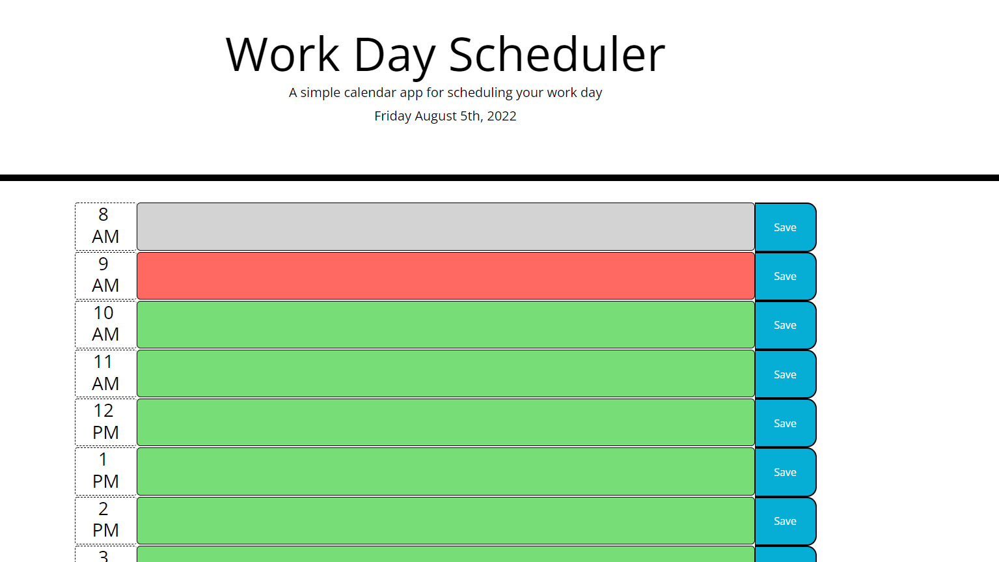

# Work Day Scheduler

In this application, you will find a simple day scheduler with the current date displayed at the top of the page. It is broken down by normal business hours and it is color coded to highlight the current hour in red, while past hours are highlighted in grey and future hours are highlighted in green.

The user can simply click inside any of the text area associated with an hour block and enter a task and click on the save button. If the user refreshes the page or navigates away then back, then those added tasks will still be saved and visible.

----
## [Link to Depolyed Application](https://momaki9.github.io/Work_Day_Scheduler/)
----
----
## [Link to Code on GitHub](https://github.com/momaki9/Work_Day_Scheduler)
----
----
## 
----
----
